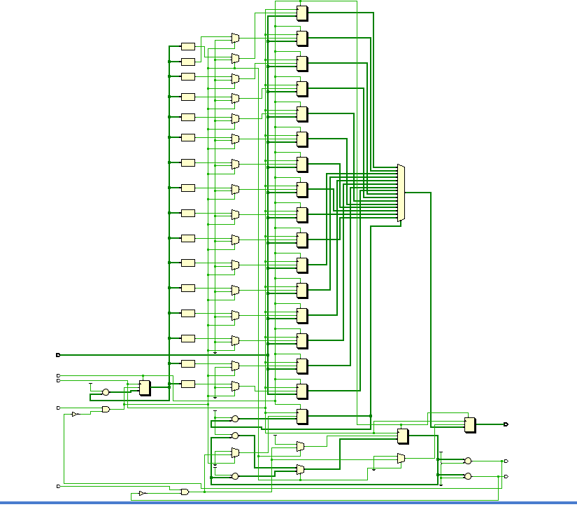
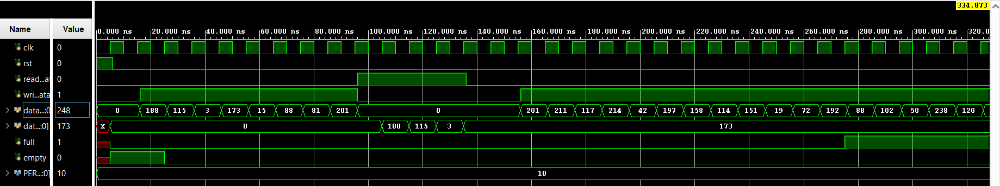

# FIFO Design and Testbench in SystemVerilog

This project demonstrates a simple synchronous FIFO (First-In-First-Out) memory design in SystemVerilog along with a testbench to simulate and validate its functionality.

## 📷 Diagrams

### RTL View

### Simulation Waveform

---

## 🔧 Functionality

The FIFO module accepts 8-bit data inputs and stores them in a queue-like structure. It supports synchronous read and write operations and raises appropriate flags when the buffer is full or empty.

### ✅ Inputs:
- `clk`: Clock signal
- `rst`: Synchronous reset
- `write_data`: Enable signal to write to FIFO
- `read_data`: Enable signal to read from FIFO
- `data_input [7:0]`: 8-bit data to be written

### ⬅️ Outputs:
- `data_output [7:0]`: 8-bit data read from FIFO
- `full`: FIFO full flag
- `empty`: FIFO empty flag

---

## 🔁 States

Although the FIFO uses no FSM, its behavior transitions between the following logical states:

- **Idle**: No operation (write_data and read_data are low)
- **Write**: Data is written when write_data is high and FIFO is not full
- **Read**: Data is read when read_data is high and FIFO is not empty
- **Full**: Indicates no more data can be written
- **Empty**: Indicates no more data can be read

---

## 🌟 Key Features

- 8-bit wide data support
- Dynamic `counter` logic for tracking FIFO size
- Robust `full` and `empty` flag logic
- Handles over-read and over-write conditions gracefully

---

## 🧪 Testbench Highlights

The testbench tests multiple scenarios including:

### Scenario 1: Writing into FIFO
Fills FIFO halfway and displays the status.

### Scenario 2: Reading from FIFO
Reads out some of the values to check correct FIFO behavior.

### Scenario 3: Full FIFO Condition
Attempts to overfill FIFO and checks that data is not overwritten.

### Scenario 4: Empty FIFO Condition
Attempts to over-read FIFO and checks that no invalid data is read.

Testbench also includes a waveform generator (`dump.vcd`) for analysis.

---

## 📚 Learning Outcomes

- Understanding of how FIFO buffers are implemented and tested.
- Experience using `SystemVerilog` testbenches with scenarios and assertions.
- Simulation techniques using `$urandom_range`, `$display`, and `VCD` dumping.
- Insight into flag generation logic (`full`, `empty`) and capacity tracking.

---

## 🛠️ Tools Used

- SystemVerilog
- Icarus Verilog or other SV-compatible simulators
- GTKWave (for waveform analysis)
